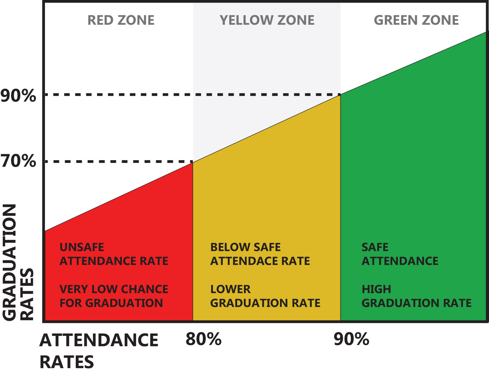

This page is where you can iterate. Follow the lab instructions in the [readme.md](./README.md).


```js
const daily = FileAttachment("./data/Daily.csv").csv({typed: true});
const schools = FileAttachment("./data/School.csv").csv({typed: true})
const borough = FileAttachment("./data/Borough.csv").csv({typed: true});
const district = FileAttachment("./data/District.csv").csv({typed: true});
```


```js
const dbnInput = Inputs.select(schools.map((d) => d.DBN), {unique: true, sort: true, label: "Show me data for", width: 100});
const selectedDBN = Generators.input(dbnInput);
```

```js
const selectedDBNname = schools.filter(d => d.DBN === selectedDBN)[0]['Name'] 


const selectedDBNdata = daily.filter(d => d.DBN === selectedDBN) 
const selectedDBNattd = schools.filter(d => d.DBN === selectedDBN)[0]['attd'] 

const selectedBorough = daily.filter(d => d.DBN === selectedDBN)[0]['Borough']
const selectedBoroughAttd = borough.filter(d => d.Borough_code === selectedBorough)[0]['Borough_attd']

const selectedDistrict = daily.filter(d => d.DBN === selectedDBN)[0]['District']
const selectedDistrictAttd = district.filter(d => d.District_code === selectedDistrict)[0]['District_attd']
```

<div class="card" style="padding: 35px 40px">
  <div>
    <div id='schoolSelector'>
      ${dbnInput}
    </div>
    <div id='naming' style="width: 100%;">
      <span style="display: flex; margin-top: 1.2rem; margin-bottom: -0.1rem; font-size: 20pt; font-weight: 900;">How was daily attendance at ${selectedDBNname} in 2018-19?</span>
      <div id='summary-scores' style="margin: 20px 0 0 0; font-size: 16pt; align: left; color: #646464; display: flex; flex-direction: row;">
        <div style='margin-right:6%;'>
          <span style='font-weight: 700'>${selectedDBNattd}</span>
          <p style='font-size: 11pt; margin-top: 3px;'>Yearly school attendance</p>
        </div>
        <div style='margin-right:6%;'>
          <span style='font-weight: 700'>${selectedBoroughAttd}</span>
          <p style='font-size: 11pt; margin-top: 3px;'>Borough attendance</p>
        </div>
        <div>
          <span style='font-weight: 700'>${selectedDistrictAttd}</span>
          <p style='font-size: 11pt; margin-top: 3px;'>District attendance</p>
        </div>
      </div>
      <span style="display: inline-block; font-size: 10.5pt; color: gray; width: 100%; margin:5px 0 -5px 0;">% of daily attendance for each school day in 2018-2019 school year and attendance levels: <span style="display: inline-block; font-weight: 900; color: #e8a5a5;">0-80%</span>, <span style="display: inline-block; font-weight: 900; color: #f2cf6e;">81-90%</span>, <span style="display: inline-block; font-weight: 900; color: #bed5c4;">91-100%</span></span>
    </div>
  </div>

```js
Plot.plot({
  y: {
  label: "Attendance",
  domain: [0.0, 1],
  tickFormat: ((f) => (x) => f((x)))(d3.format(".0%"))},
  marginLeft: 45,
  marginTop: 32,
  height: 375,
  width,
  marks: [
    Plot.ruleY([0]),
    Plot.rectY(
      [
      { y1:0, y2:0.8, label: "Severe Chronic Absenteeism ", color: "#ffcccc" },
      { y1:0.8, y2:0.9, label: "Chronic Absenteeism", color: "#fff3cd"},
      { y1:0.9, y2:1, label: "Good attendance", color:"#d4edda"}
    ], 
    {
      y1: "y1",
      y2: "y2",
      fill: "color",
      fillOpacity: 0.4 // Makes the colors subtle
    }),
    Plot.line(selectedDBNdata, {
      x: "Date",
      y: "Attd",
      tip: true,
      title: (d) => `${d.Date.toLocaleString(undefined, {
        month: "short",
        day: "numeric",
        weekday: "short"
      })}\nDaily Attendance - ${d.Attd.toLocaleString(undefined, {
        style: "percent"
      })}`
    })
  ]
})
```

<details>
  <summary>What do color bands mean?</summary>
    <figure>
      
      <figcaption>Source: <a href='https://www.ddouglas.k12.or.us/departments/student-services/attendance/what-is-regular-attendance/'>Davis Douglas School District</a></figcaption>
    </figure>
</details>

---

## Dig deeper into the data

```js
const DBNsearch = view(Inputs.search(daily, {placeholder: "Search school DBNs"}));
```

```js
Inputs.table(DBNsearch)
```
