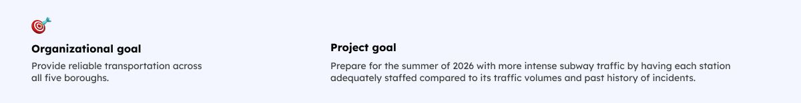
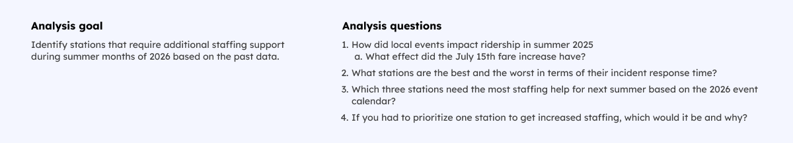
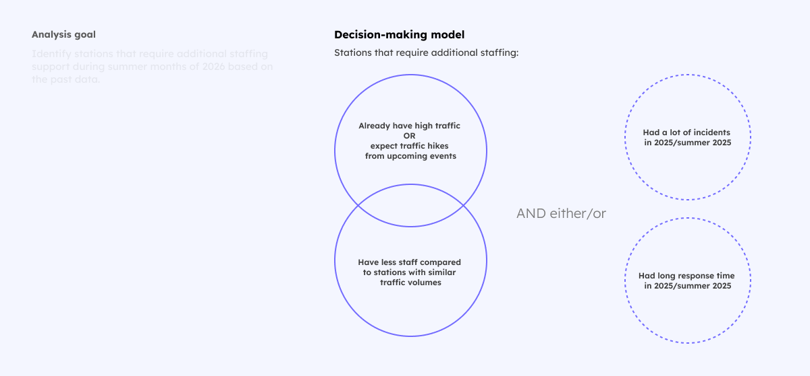
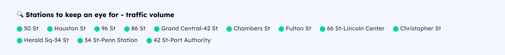
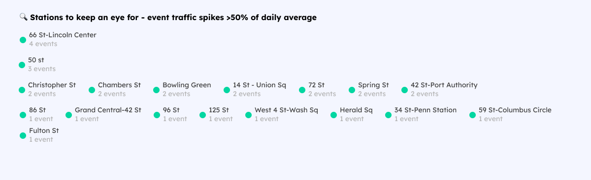
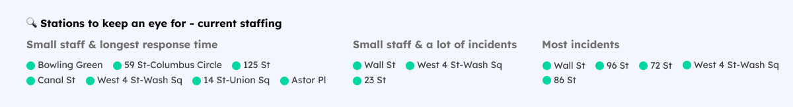
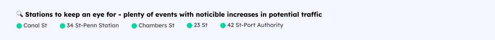
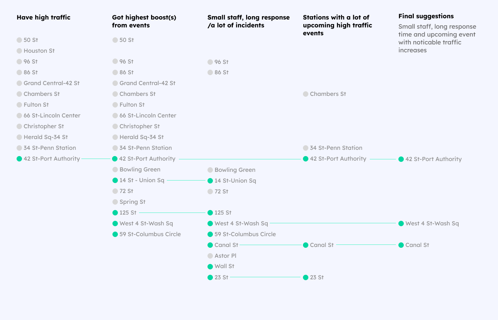

This page is where you can iterate. Follow the lab instructions in the [readme.md](./README.md).

<link rel="preconnect" href="https://fonts.googleapis.com">
<link rel="preconnect" href="https://fonts.gstatic.com" crossorigin>
<link href="https://fonts.googleapis.com/css2?family=Lexend:wght@100..900&display=swap" rel="stylesheet">

<style>
  body, svg {
    font-family: Lexend;
    font-size: 12pt;
  }

  p {
    max-width: 60%;
  }
</style>

<!-- Import Data -->
```js
const incidents = FileAttachment("./data/incidents.csv").csv({ typed: true })
const local_events = FileAttachment("./data/local_events.csv").csv({ typed: true })
const upcoming_events = FileAttachment("./data/upcoming_events.csv").csv({ typed: true })
const ridership = FileAttachment("./data/ridership.csv").csv({ typed: true })
const traffic_avgs = FileAttachment("./data/traffic_avgs.csv").csv({ typed: true })
const traffic_events_change = FileAttachment("./data/traffic_events_change.csv").csv({ typed: true })
const fare_change = FileAttachment("./data/fare_change.csv").csv({ typed: true })
const incidents_data = FileAttachment("./data/incidents_chart.csv").csv({ typed: true })
const staffing_data = FileAttachment("./data/staffing_chart.csv").csv({ typed: true })
const scatter_data = FileAttachment("./data/scatter_data.csv").csv({ typed: true })

```

<!-- Include current staffing counts from the prompt -->
```js
const currentStaffing = {
  "Times Sq-42 St": 19,
  "Grand Central-42 St": 18,
  "34 St-Penn Station": 15,
  "14 St-Union Sq": 4,
  "Fulton St": 17,
  "42 St-Port Authority": 14,
  "Herald Sq-34 St": 15,
  "Canal St": 4,
  "59 St-Columbus Circle": 6,
  "125 St": 7,
  "96 St": 19,
  "86 St": 19,
  "72 St": 10,
  "66 St-Lincoln Center": 15,
  "50 St": 20,
  "28 St": 13,
  "23 St": 8,
  "Christopher St": 15,
  "Houston St": 18,
  "Spring St": 12,
  "Chambers St": 18,
  "Wall St": 9,
  "Bowling Green": 6,
  "West 4 St-Wash Sq": 4,
  "Astor Pl": 7
}
```

## What are we doing here?

I feel it's important to outline task and its parameters I used to solve it so we can be on the same page. Most of it was outside of this lab, so I came up with it. To make it easier, I put the information in the toggle below.
<details>
  <summary>Show details</summary>
  First, let's settle down on the organizational and project goals that would frame what business/org functions our analysis needs to support.

  

  Bases of this, I formulated the analysis goal - how this work can contribute towards the main goals.
  

  Finally, before answering the main question about staffing needs, I outlined my understanding of how decisions might be made. I do not know anything about this subject field. However, I needed something to rely on in making suggestions to imaginary bosses. 

  So below are the criteria for deciding what stations should be prioritize in staffing decisions.

  
</details>


<div class="tip">For the best viewing experience, I suggest to view this lab in the full screen without the left-side panel.</div>


## Events brought people but not equaly

Let's start with identifying stations that already have high traffic. Incidents or bottlenecks there will affect more people, it would make sense to prioritize properly staffing them first. 

<div class="note">In this context, I define "traffic" only as station entrances, not exits. For the most part, the numbers are close enough and seemingly do not have clear patterns of provide meaningful clues to consider "exits" separately.</div>


Below is a chart showing daily traffic across all 25 stations in the summer 2025 - June 1-Aug 14. Stations are sorted by their average daily traffic. You can get details about each day traffic at a particular station, if you hover over their respective charts.

<!-- Chart 1.1 - Daily traffic, bare ridgeline -->
```js
    Plot.plot({
      height: 580,
      width,
      marginLeft: 150,
      x: {
        axis: null     
      },
      y: {
        axis: null, 
        label: null, 
        domain: [0, 28000], 
        range: [35, 0]
      },
      fy: {
        paddingInner: 0,
        label: null, 
        domain: ["50 St", "Houston St", "86 St", "96 St", "Grand Central-42 St", "Chambers St", "Fulton St", "Times Sq-42 St", "Herald Sq-34 St", "34 St-Penn Station", "Christopher St", "66 St-Lincoln Center", "28 St", "42 St-Port Authority", "Spring St", "72 St", "Wall St", "23 St", "125 St", "Astor Pl", "Bowling Green", "59 St-Columbus Circle", "Canal St", "West 4 St-Wash Sq", "14 St-Union Sq"]},
      facet: {
        data: ridership,
        y: "station"
      },
      style: {
        fontSize: "10pt",
      },
      marks: [
        Plot.axisX({
            fontSize: 11,
            color: "#A9A9A9",
            anchor: "bottom",
            tickPadding: 3,
            ticks: 15
          }),
        d3.groups(ridership, d => d.station).map(([, values]) => [
          Plot.areaY(values, {
            x: "date", 
            y: "entrances", 
            fy: "station", 
            curve: "basis", 
            sort: "date", 
            fill: "#3300FF", 
            fillOpacity: 0.4
          }),
          Plot.lineY(values, {
            x: "date", 
            y: "entrances", 
            fy: "station", 
            curve: "basis", 
            sort: "date", 
            strokeWidth: 0.75, 
            stroke: "#330099", 
          })
        ]),
        Plot.tip(ridership, Plot.pointer({
          x: "date",
          y: "entrances",
          fy: "station",
          title: (d) => `Ⓜ️ ${d.station}\n\n` + d.date.toISOString() + `\n\nDaily entrances - ${d.entrances}`,

        }))
      ]
    })
```

First thing to note is that stations varied significantly in terms of their daily traffic. Some had 15k+ people pass through, some barely cracked 5k. Here are the leaders - they will be the first one to check since there are a lot more ppl who may expecience disruption.



Going deeper, we can see that throughout the whole summer stations have ups and downs in daily traffic. Some of it can be attributed to weekday cycles - more people use subway in FiDi on a Wednesday than on a Saturday. However, nearly all stations have peaks that standout significantly more. They can be explained if we add another layer to the chart - nearby events.

Below are the local events - red bars - that took place during summer 2025, mapped to their respective nearby stations. Heights of each bar is an estimated event attendance.

<!-- Chart 1.2 - Daily traffic, layered ridgeline -->
```js
    Plot.plot({
      height: 580,
      width,
      marginLeft: 150,
      x: {
        axis: null     
      },
      y: {
        axis: null, 
        label: null, 
        domain: [0, 28000], 
        range: [35, 0]
      },
      fy: {
        paddingInner: 0,
        label: null, 
        domain: ["50 St", "Houston St", "86 St", "96 St", "Grand Central-42 St", "Chambers St", "Fulton St", "Times Sq-42 St", "Herald Sq-34 St", "34 St-Penn Station", "Christopher St", "66 St-Lincoln Center", "28 St", "42 St-Port Authority", "Spring St", "72 St", "Wall St", "23 St", "125 St", "Astor Pl", "Bowling Green", "59 St-Columbus Circle", "Canal St", "West 4 St-Wash Sq", "14 St-Union Sq"]
      },
      facet: {
        data: ridership,
        y: "station"
      },
      style: {
        fontSize: "10pt",
      },
      marks: [
        Plot.axisX({
            fontSize: 11,
            color: "#A9A9A9",
            anchor: "bottom",
            tickPadding: 3,
            ticks: 10
          }),
        Plot.ruleX(local_events, {
          x: "date", 
          y: d => d.estimated_attendance, 
          fy: "nearby_station", 
          dy: 0,
          stroke: "#FF0000", 
          strokeWidth: 4, 
          opacity: 0.45}),
        d3.groups(ridership, d => d.station).map(([, values]) => [
          Plot.areaY(values, {
            x: "date", 
            y: "entrances", 
            fy: "station", 
            curve: "basis", 
            sort: "date", 
            fill: "#3300FF", 
            fillOpacity: 0.4
          }),
          Plot.lineY(values, {
            x: "date", 
            y: "entrances", 
            fy: "station", 
            curve: "basis", 
            sort: "date", 
            strokeWidth: 0.75, 
            stroke: "#330099", 
          })
        ]),
        Plot.tip(["Most events increased daily traffic at their nearby stations..."], {
          x: [new Date("2025-07-01")],
          fy: ["50 St"], 
          anchor: "left",
          frameAnchor: "top-left",
          dx: 6,
          dy: -2,
        }),
        Plot.tip(["... despite event attendance varying widely."], {
          x: [new Date("2025-07-30")],
          fy: ["50 St"], 
          anchor: "top",
          frameAnchor: "bottom",
          dx: 0,
          dy: -5,
        }),
        Plot.tip(["Some events even had higher attendance than daily traffic at nearby stations."], {
          x: [new Date("2025-06-15")],
          fy: ["125 St"], 
          anchor: "top-left",
          frameAnchor: "left",
          dx: -1,
          dy: 5,
        }),
        Plot.tip(local_events, Plot.pointer({
          x: "date",
          y: "day_entry",
          fy: "nearby_station",
          title: (d) => `Ⓜ️ ${d.nearby_station}\n\n${d.event_name}  |  ` + d.date.toISOString() + `\n\nEvent attendance - ${d.estimated_attendance}`
        }))
      ]
    })
```

This definitely explained most traffic spikes. Another thing to note is that traffic not always increased with the same magnitude as event attendance - some events had either significantly lower attendance than a selected daily jump from an average (e.g. "Summer Concert Series" on June 20th at 66 St-Lincoln Center) or event attendance higher than daily traffic. How and to what extent event attendance converted into increased traffic is outside of the scope of this analysis. One thing seems to be clear - events contiributed to stations getting more traffic. How much though?

It's hard to say just be looking at this chart so let's have a more precise look. Below are all events and how much different that day traffic a particular station got, compared to their average daily traffic. To make this comparison more representation of a regular day, I calculated station average based on daily entrances, except for the days of events since they are, as we established, at more likely affected traffic.

<!-- Chart 2 - Events traffic change, lollipop -->

```js
// Assuming data has 'id' and 'name' columns
const eventsMap = new Map(traffic_events_change.map(d => [d.event_st, d.station]));
```

```js
Plot.plot({
  x: {
    ticks: 5,
    percent: true,
    domain: [0, 133],
    tickPadding: 5,
    axis: "top",
    label: "Traffic change from average", 
    labelOffset: 45,
    grid: true,
    color: "#A9A9A9",
    fontSize: 10
  },
  y: {
    label: null,
    tickPadding: 15, 
  },
  marginLeft: 450,
  marginTop: 50,
  height: 1500,
  width: 1000,
  fy: {
    label: null
  },
  style: {
    fontSize: "11pt",
    color: '#505050'
  },
  marks: [
    Plot.axisY({
      fontSize: 14,
      tickPadding: 8,
      tickSize: 0
    }),
    Plot.ruleY(traffic_events_change, {
        y: "event_st", 
        x: "traffic_change", 
        stroke: "#0000FF", 
        opacity: 0.5,
        sort: {y: "x", reverse: true}, 
        strokeWidth: 4
      }),
    Plot.dot(traffic_events_change, {
        y: "event_st", 
        x: "traffic_change", 
        fill: "#0000FF", 
         r: 3}),
    Plot.text(traffic_events_change, {
        y: "event_st", 
        x: "traffic_change", 
        text: (d) => (d.traffic_change * 100).toFixed(0) + "%", 
        dx: 25
      }),
    Plot.tip(traffic_events_change, Plot.pointer({
        y: "event_st", 
        x: "traffic_change", 
        title: (d) => `Average station traffic - ${d.avg_traffic}\n\nEvent attendance - ${d.event_attd}\n\nTraffic on that day - ${d.day_traffic}`
      }))
  ]
})
```

This confirmed my hypothesis - events definitely increased stations traffic. At the same time, changes varied significantly - Some stations got 20% more traffic in a day, some more than 100%. 

Here are the stations that experienced highest hikes from events:



Without looking at more data we cannot say why the increases were that different, or ever state for sure that events causes all or some of it. However, without confirming the causation, we can point out to correlation - on the days of events nearby stations had higher traffic than usual. We will need to take this principal and potential traffic change magnitutes when we plan for the summer of 2026.

## Fare increase might have affected traffic

Another thing to keep in mind when thinking about stations staffing based on their daily traffic, is that it can change not only due to nearby events. Quality of service - e.g. safety, timeliness - and subway affordability compared to other ways to get around the city are among reason people choose subway. I'll delve deeper into the timeliness piece later but now let's take a glance at the affordability.

To cover regular expenses, the subway system raises its fares from time to time, which naturally affects how affordable it is for passangers and, on the other hand, how we prioritize stations in terms of staffing - if there are less people using the subway/its parts, we may need to focus on them less.

During the summer of 2025 there was a fare increase on July 15th. Let's look at how it affected the daily traffic. To do this, I compared same period before and after the fare increase. Below is the chart showing average daily traffic at each station before and after.

<!-- Chart 3 - Fare increase, slope graph -->
```js

const occlusionY = ({radius = 6.5, ...options} = {}) => Plot.initializer(options, (data, facets, { y: {value: Y}, text: {value: T} }, {y: sy}, dimensions, context) => {
  for (const index of facets) {
    const unique = new Set();
    const nodes = Array.from(index, (i) => ({
      fx: 0,
      y: sy(Y[i]),
      visible: unique.has(T[i]) // remove duplicate labels
        ? false
        : !!unique.add(T[i]),
      i
    }));
    d3.forceSimulation(nodes.filter((d) => d.visible))
      .force("y", d3.forceY(({y}) => y)) // gravitate towards the original y
      .force("collide", d3.forceCollide().radius(radius)) // collide
      .stop()
      .tick(200);
    for (const { y, node, i, visible } of nodes) Y[i] = !visible ? NaN : y;
  }
  return {data, facets, channels: {y: {value: Y}}};
})
```

```js
Plot.plot({
  height: 500,
  y: {axis: null, inset: 20},
  width: 700,
  marginLeft: 100,
  marginRight: 100,
  y: {domain: [4700, 19500], label: null, axis: null},
  style: {fontSize: "9pt"},
  marks: [
    Plot.line(fare_change, {
      x: "period", y: "value", z: "station", 
      stroke: "var(--theme-foreground-focus)",
      mixBlendMode: dark ? "screen" : "multiply",
      tip: {
        render(index, scales, values, dimensions, context, next) {
          // Filter and highlight the paths with the same *z* as the hovered point.
          const path = d3.select(context.ownerSVGElement).selectAll("[aria-label=line] path");
          if (index.length) {
            const z = values.z[index[0]];
            path.style("stroke", "var(--theme-foreground-faintest)")
              .filter(([i]) => values.z[i] === z)
                .style("stroke", null)
                .raise();
          }
          else path.style("stroke", null);
          // Render the tip.
          return null;
        }
      }
    }),
    Plot.axisX({
      fontSize: 14,
      tickSize: 5,
      color: "#404040",
      fontWeight: 900,
      anchor: "top", 
      label: null,
      type: "ordinal", tickFormat: "", abel: null,
      tickFormat: d => ({'7_14': "Before raise (Jun 15-Jul 14)", '8_14': "After raise (Jun 15-Aug 14)"})[d]}),
    d3.groups(fare_change, (d) => d.period === "7_14")
      .map(([left, fare_change]) =>
        Plot.text(fare_change, occlusionY({
          x: "period",
          y: "value",
          text: left
            ? (d) => `${d.station} - ${(d.value/1000).toFixed(1) + "k"}`
            : (d) => `${d.station} - ${(d.value /1000).toFixed(1) + "k"}`,
          textAnchor: left ? "end" : "start",
          dx: left ? -10 : 10,
          radius: 6
        }))
      )
  ]
})
```
From the chart we can see that the average daily traffic decreased across all stations. The magnitude of descrease is varying - stations that had higher daily traffic saw steeper decline compared to less traffic-heavy ones.

However, in this case it's hard to say whether it was the fare increase that led to it - maybe just the latter half of summer when ppl are vacationing. We need more data to get closer to confirming the causal relationship - either data about vacation timelines of New Yorker or more data about traffic over the same period last summer and after this summer to see if the trends continue to be present in either case.

Now let's look at another aspect of stations in question - timeliness and reliability of service.


## Less staff, longer fixing time

An important consideration for additional staffing, according to our decision-making model, is how well a station crew can handle incidents that slow or altogether stop traffic. The key ascertion here is that having more people on a station staff helps to deal with incidents faster and decrease their number.

Let's see if that's true. Below is the chart mapping all incidents from 2015 to Summer 2025, response time for each of them, average response time for a station and staffing for a station - current and a range of staffing levels over the years. The chart is sorted by the current staffing level and them by average response time.


<div style="display: flex; flex-direction: row; flex-flow: space-between;">
  <div>
    <p style="position: relative; left: 17%; font-size: 11pt; font-weight: 700; color: gray;">All incidence in 2015-May 2025</p>
  <!-- Chart 4.1 - Incidents (old), heatmap -->

  ```js
  Plot.plot({
        padding: 0,
        legend: true,
        width: 910,
        height: 550,
        marginTop: 17,
        marginLeft: 155,
        marginRight: 0,
        insetRight: 20,
        x: {
          label: null
        },
        y: {
          tickSize: 5, 
          tickPadding: 8,
          grid: true,
          label: null,
          domain: ["West 4 St-Wash Sq", "Canal St", "14 St-Union Sq", "59 St-Columbus Circle", "Bowling Green", "125 St", "Astor Pl", "23 St", "Wall St", "72 St", "Spring St", "28 St", "42 St-Port Authority", "Christopher St", "66 St-Lincoln Center", "Herald Sq-34 St", "34 St-Penn Station", "Fulton St", "Chambers St", "Grand Central-42 St","Houston St", "96 St", "86 St", "Times Sq-42 St", "50 St"]
        },
        style: {
          fontSize: "10pt"
        },
        color: {
          type: "linear",
          scheme: "ylorrd",
          domain: [0, 27]},
        marks: [
          Plot.cell(incidents_data, {
                filter: (d) => d.incident_period == "2015-May 2025",
                x: "incident_id", y: "station", fill: "response_time", inset: 1}),
          Plot.axisX({
            fontSize: 9,
            color: "#A9A9A9",
            anchor: "top"}),
          Plot.tip(incidents_data.filter((d) => d.incident_period == "2015-May 2025"), Plot.pointer({
            x: "incident_id",
            y: "station",
            title: (d) => d.incident_date.toLocaleString(undefined, {weekday: "short", month: "short", year: "numeric", day: "numeric"}) + `\n\nIncident severity - ${d.severity}\nResponse time - ${d.response_time}`,
            fontSize: 11
          }))
        ]
      })
  ```
  </div>
  <div>
    <p style="position: relative; left: 5px; font-size: 11pt; font-weight: 700; color: gray;">Summer'25</p>
  <!-- Chart 4.2 - Incidents (2025), heatmap -->

  ```js
  Plot.plot({
        padding: 0,
        marginTop: 18,
        height: 530,
        width: 115,
        style: {overflow: "visible"},
        marginLeft: 0,
        marginRight: 2,
        insetRight: 70,
        x: {label: null, domain: [1, 2]},
        y: {
          grid: true,
          axis: null,
          label: null,
          domain: ["West 4 St-Wash Sq", "Canal St", "14 St-Union Sq", "59 St-Columbus Circle", "Bowling Green", "125 St", "Astor Pl", "23 St", "Wall St", "72 St", "Spring St", "28 St", "42 St-Port Authority", "Christopher St", "66 St-Lincoln Center", "Herald Sq-34 St", "34 St-Penn Station", "Fulton St", "Chambers St", "Grand Central-42 St","Houston St", "96 St", "86 St", "Times Sq-42 St", "50 St"]
        },
        color: {type: "linear", scheme: "ylorrd", domain: [0, 27]},
        marks: [
          Plot.cell(incidents_data, {
                filter: (d) => d.incident_period == "Summer of 2025",
                x: "incident_id", y: "station", fill: "response_time", inset: 1}),
          Plot.axisX({
            fontSize: 9,
            color: "#A9A9A9",
            anchor: "top"
          }),
          Plot.tip(incidents_data.filter((d) => d.incident_period == "Summer of 2025"), Plot.pointer({
            x: "incident_id",
            y: "station",
            title: (d) => d.incident_date.toLocaleString(undefined, {weekday: "short", month: "short", year: "numeric", day: "numeric"}) + `\n\nIncident severity - ${d.severity}\nResponse time - ${d.response_time}`,
            fontSize: 11
          }))
        ]
      })
  ```
  </div>
   <div>
    <p style="position: relative; left: 5px; font-size: 11pt; font-weight: 700; color: gray;">Avg. fix ⏱️</p>
  <!-- Chart 4.2 - Incidents (2025), heatmap -->

  ```js
  Plot.plot({
        padding: 0,
        marginTop: -7,
        height: 513,
        width: 85,
        insetRight: 20,
        style: {
          overflow: "visible",
          fontSize: '10pt'
        },
        marginLeft: 0,
        x: {
          label: null,
          axis: null
        },
        y: {
          grid: true,
          axis: null,
          label: null,
          domain: ["West 4 St-Wash Sq", "Canal St", "14 St-Union Sq", "59 St-Columbus Circle", "Bowling Green", "125 St", "Astor Pl", "23 St", "Wall St", "72 St", "Spring St", "28 St", "42 St-Port Authority", "Christopher St", "66 St-Lincoln Center", "Herald Sq-34 St", "34 St-Penn Station", "Fulton St", "Chambers St", "Grand Central-42 St","Houston St", "96 St", "86 St", "Times Sq-42 St", "50 St"]
        },
        color: {
          type: "linear", scheme: "ylorrd", domain: [0, 27]
        },
        marks: [
          Plot.cell(incidents_data, Plot.groupY({x: "mean"}, {x: 0, y: "station", fill: "response_time"})),
          Plot.text(incidents_data, Plot.groupY({x: "mean", text: "mean"}, {x: 0, y: "station", text: d => d.response_time.toFixed(1)}))
        ]
      })
  ```
  </div>
  <div>

  <p style="font-size: 11pt; font-weight: 700; color: gray; margin-bottom: -15px;">👷 Staff <br><span style="font-size: 9pt; color: #A9A9A9;">Now (past)</span></p>
  <!-- Chart 4.3 - Crews, numbers -->

  ```js
    Plot.plot({
    width: 120,
    height: 530,
    marginLeft: 5,
    marginTop: 9,
    x: {axis: null},
    y: {
      padding: 0.4, 
      axis: null, 
      label: null,
      domain: ["West 4 St-Wash Sq", "Canal St", "14 St-Union Sq", "59 St-Columbus Circle", "Bowling Green", "125 St", "Astor Pl", "23 St", "Wall St", "72 St", "Spring St", "28 St", "42 St-Port Authority", "Christopher St", "66 St-Lincoln Center", "Herald Sq-34 St", "34 St-Penn Station", "Fulton St", "Chambers St", "Grand Central-42 St","Houston St", "96 St", "86 St", "Times Sq-42 St", "50 St"]
},
 style: {
    fontSize: "10pt",
    overflow: "visible",
    color: "gray"
  },
    marks: [
      Plot.text(staffing_data, {
        tip: true,
        frameAnchor: "left",
        y: "station",
        text: (d) => d.staff_now + " (" + d.staff_range + ")"      })
    ]  
  })
  ```
  </div>
</div>

First, some good news - most incidents happened before Summer 2025. However, some bad news - some stations struggled a lot more than others. But why? 

There are two noticible differences between stations in the top rows compared to the bottom ones - staffing lever and response times. 
This distinctions seemingly splits the data around 10-14 staff members and above/under 15 minutes for response time.

The number of incidents doesn't seem to be directly affected by these distinctions. Stations with a lot of incidents had various staff size and average response time - e.g. Wall Street and 96 Street have vastly different characteristics. Therefore, # of incidents by itself doesn't seem to be a good indicator of the need for additional staffing. The age of a station, how well it has been maintained in the past and if it was renovated probably is more at play here. 

Staff size, however, clearly affect incident response time. Stations with longest response time - over 15 min have/had under 8 staff members, with 4 being the lowest. Same stations are among ones with longest response time ones. While stations with plenty of staff like 96th Street with 19 staff members, Houston Streer with 18 or 66 Street-Lincoln Center with 15 have the fastest averare response time.


Here are the stations that may require additional attention based on this:




Finally, let's move to the future - what stations may have more traffic in the summer of 2026.


## Planning with the 2026 events in mind

As we established, events increase traffifc at nearby stations. We, however, cannot fully predict by how much. Despite this we need to have some sense of what's coming. To get this I assumed that at least 25% of event attendance will then use the subway.

Below is the list of all stations with events scheduled for summer of 2026, grouped by the current staffing. Events are grouped by their nearby station and show what daily traffic that day could be, if 25% of an event attendance uses the subway. Hover over ends of each arrow to see details about an event.

<div style="margin-top: 10px;">
  <p style="font-size: 12pt; font-weight: 700; color: #A0A0A0; margin-bottom: -15px;">0-4 staff members currently</p>
  <!-- Chart 5.1 - Future events (0-4 staff), arrow chart (idk) -->

  ```js
  Plot.plot({
    width: 1220,
    height: 85,
    marginLeft: 155,
    x: {
      grid: true,
      domain: [5000, 20000], 
      ticks: 4,
    },
    y: {label: null, grid: true},
    color: {scheme: 'blues'},
    style: {
      overflow: "visible"
    },
    marks: [
      Plot.axisX({
        fontSize: 13,
        tickPadding: 5,
        color: "#909090",
        anchor: 'top',
        ticks: 4
      }),
      Plot.axisY({
        fontSize: 14,
        color: "#505050"
      }),
      Plot.arrow(scatter_data.filter((d) => d.staff_now_group == '0-4'),
      {
        x1: "avg_no_event",
        x2: "expected_25",
        y: "station",
        bend: 30,
        headLength: 5,
        strokeWidth: 1.5,
        sort: {y: "x1", reverse: true},
        opacity: 0.85,
        stroke: (d) => d.expected_25 - d.avg_no_event,
        stroke: 'change_25'
      }),
      Plot.tip(scatter_data.filter((d) => d.staff_now_group == '0-4'), Plot.pointer({
        x: "expected_25",
        y: "station",
        title: (d) => d.event_name + "  |  " +  d.date.toLocaleString(undefined, {weekday: "short", month: "short", day: "numeric"}) + `\n\nAverage traffic, Summer'25 w/o events - ${d.avg_no_event}\nProspective traffic - ${d.expected_25}\nCurrent staff - ${d.staff_now}`
    }))
    ]
  })
  ```
</div>
<div style="margin-top: -5px;">
  <p style="font-size: 12pt; font-weight: 700; color: #A0A0A0; margin-bottom: -25px;">5-10 staff members</p>
  <!-- Chart 5.2 - Future events (5-10 staff), arrow chart (idk) -->

  ```js
  Plot.plot({
    width: 1200,
    height: 125,
    marginLeft: 155,
    x: {axis: null,  grid: true, domain: [5000, 20000], ticks: 4},
    y: {label: null, grid: true, color: "gray"
},
    color: {scheme: 'blues'},
    style: {
      fontSize: "10.5pt",
      overflow: "visible",
    },
    marks: [
      Plot.axisY({
        fontSize: 14,
        color: "#505050"
      }),
      Plot.arrow(scatter_data.filter((d) => d.staff_now_group == '5-10'),
      {
        x1: "avg_no_event",
        x2: "expected_25",
        y: "station",
        sort: {y: "x1", reverse: true},
        bend: 30,
        headLength: 5,
        strokeWidth: 2,
        opacity: 0.85,
        stroke: (d) => d.expected_25 - d.avg_no_event,
        stroke: 'change_25'
      }),
      Plot.tip(scatter_data.filter((d) => d.staff_now_group == '5-10'), Plot.pointer({
        x: "expected_25",
        y: "station",
        title: (d) => d.event_name + "  |  " +  d.date.toLocaleString(undefined, {weekday: "short", month: "short", day: "numeric"}) + `\n\nAverage traffic, Summer'25 w/o events - ${d.avg_no_event}\nProspective traffic - ${d.expected_25}\nCurrent staff - ${d.staff_now}`
    }))
    ]
  })
  ```
</div>
<div style="margin-top: -5px;">
  <p style="font-size: 12pt; font-weight: 700; color: #A0A0A0; margin-bottom: -25px;">11+ staff members</p>

  <!-- Chart 5.3 - Future events (11+ staff), arrow chart (idk) -->

  ```js
  Plot.plot({
    width: 1200,
    height: 295,
    marginLeft: 155,
    x: {axis: null,  grid: true, domain: [5000, 20000], ticks: 4},
    y: {label: null, grid: true},
    color: {scheme: 'blues'},
    style: {
      fontSize: "10.5pt",
      overflow: "visible"
    },
    marks: [
      Plot.axisY({
        fontSize: 14,
        color: "#505050"
      }),
      Plot.arrow(scatter_data.filter((d) => d.staff_now_group == '11+'),
      {
        x1: "avg_no_event",
        x2: "expected_25",
        y: "station",
        sort: {y: "x1", reserve: true},
        bend: 30,
        headLength: 5,
        strokeWidth: 2,
        opacity: 0.85,
        stroke: (d) => d.expected_25 - d.avg_no_event,
        stroke: 'change_25'
      }),
      Plot.tip(scatter_data.filter((d) => d.staff_now_group == '11+'), Plot.pointer({
        x: "expected_25",
        y: "station",
        title: (d) => d.event_name + "  |  " +  d.date.toLocaleString(undefined, {weekday: "short", month: "short", day: "numeric"}) + `\n\nAverage traffic, Summer'25 w/o events - ${d.avg_no_event}\nProspective traffic - ${d.expected_25}\nCurrent staff - ${d.staff_now}`
    }))
    ]
  })
  ```
</div>

Just like the last summer, events are not spread equaly between stations - some, like Wall Street, have only 1 event scheduled with modest expected attendance, while others like Canal Street have multiple events that could increase their on the day traffic by 1/3. This, however, shows the general trend - stations with 0-4 staff members have the lowest average daily traffic but expect a decent bumps from events while stations with 11+ staff members have the highest average traffic with highest expected bumps.

Here are ther stations I'd suggest to consider for additional staffing, based on the 2026 events calendar (not my final recommendation though):



## Final conclusions and recommedations

Now let's finalize all things we discovered:

1. Yes, events affected daily traffic at nearby stations increasing it by 11-127%
2. Fare increase might affect traffic - less people used the subway after the increase. However, we don't have enough data (time-wise and in terms of available variables) to say for sure if it happened because of the increase.
3. Based on the summer 2026 events schedule and everything we discussed before, I'd suggest increasing staffing at Canal Street, West 4 St-Washington Square and 42 St-Post Authority. These three stations have scheduled events that could increase their traffic, less staff and longer incident response time. 
Below is my logic visualized, following the decision-making model described in the beginning.




