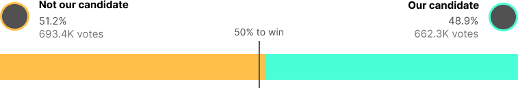

This page is where you can iterate. Follow the lab instructions in the [readme.md](./README.md).

<style>
  body, svg {
    font-size: 12pt;
  }

  main {
    max-width: 60%;
    margin: 0 auto;
  }

  p, h1, h2, h3, h4 {
    max-width: 100%
  }

  .title-card {
    text-align: center;
    line-height: 1.05;
    margin-bottom: -5px;
    z-index: 1;
  }

  .main-title-card {
    font-weight: 900;
    font-size: 40pt;
  }

  .sub-title-card {
    font-weight: 600;
    font-size: 25pt;
  }

  .title-graph {
    position: relative;
    z-index: -2;
  }
</style>

<!-- Import Data -->
```js
const nyc = await FileAttachment("data/nyc.json").json();
const results = await FileAttachment("data/election_results.csv").csv({ typed: true });
const survey = await FileAttachment("data/survey_responses.csv").csv({ typed: true });
const survey_agg = await FileAttachment("data/survey_agg.csv").csv({ typed: true });
const events = await FileAttachment("data/campaign_events.csv").csv({ typed: true });

// Note: you don't have to keep this, but some helpful data exposure to see what we've loaded. 
// NYC geoJSON data
display(nyc)
// Campaign data (first 10 objects)
display(results.slice(0,10))
display(survey.slice(0,10))
display(events.slice(0,10))
```


```js
// The nyc file is saved in data as a topoJSON instead of a geoJSON. Thats primarily for size reasons -- it saves us 3MB of data. For Plot to render it, we have to convert it back to its geoJSON feature collection. 
const districts = topojson.feature(nyc, nyc.objects.districts)
display(districts)

```

```js
const resultsByDistrict = new Map(results.map(d => [d.BoroCD, d.pct_candidate]))
display(resultsByDistrict)
```

<p class='title-card main-title-card'>Yes, we lost</p>
  
<p class='title-card sub-title-card'>But why?<br>And what can we do differently next time to win?</p>


<!-- Section: Overall results -->

## Manhattan, Queens and Staten Island did not go for our candidate

First, let's look at results more granulally - what boroughs and districts did our candidate win?

<!-- Overall results, choropleth -->
```js
// Simple rendering of the NYC districts topoJSON
Plot.plot({
  // this projection is already zoomed into NYC
  projection: {
    domain: districts,
    type: "mercator",
  },
  color: {
    scheme: "bupu", 
    unknown: "#ddd",
    type: "linear", 
    legend: true, 
    label: "% of votes who supported our candidate", 
    percent: true, 
    domain: [0, 100] 
  },
  marks: [
    Plot.geo(districts),
    Plot.geo(districts, {
      fill: (d) => resultsByDistrict.get(d.properties.BoroCD),
      stroke: "white",
      strokeWidth: 0.5,
      tip: true
    })
  ]
})
```

<!-- Section: districts won by income level -->
<!-- Chart: three beeswarm charts -->


## Our candidate "sold" their candidacy to low-income voters but lost medium and high-earners

City districts, however, are never identical. Let's look at districts in terms of their median houusehold income. Below are each district that our candidate won vs our opponent.

```js
function beeswarm(
  data,
  { gap = 1, ticks = 50, dynamic, direction, xStrength = 0.8, yStrength = 0.05, ...options }
) {
  const dots = Plot.dot(data, options);
  const { render } = dots;

  dots.render = function () {
    const g = render.apply(this, arguments);
    const circles = d3.select(g).selectAll("circle");

    const nodes = [];
    const [cx, cy, x, y, forceX, forceY] =
      direction === "x"
        ? ["cx", "cy", "x", "y", d3.forceX, d3.forceY]
        : ["cy", "cx", "y", "x", d3.forceY, d3.forceX];
    for (const c of circles) {
      const node = {
        x: +c.getAttribute(cx),
        y: +c.getAttribute(cy),
        r: +c.getAttribute("r")
      };
      nodes.push(node);
    }
    const force = d3
      .forceSimulation(nodes)
      .force("x", forceX((d) => d[x]).strength(xStrength))
      .force("y", forceY((d) => d[y]).strength(yStrength))
      .force(
        "collide",
        d3
          .forceCollide()
          .radius((d) => d.r + gap)
          .iterations(3)
      )
      .tick(ticks)
      .stop();
    update();
    if (dynamic) force.on("tick", update).restart();
    return g;

    function update() {
      circles.attr(cx, (_, i) => nodes[i].x).attr(cy, (_, i) => nodes[i].y);
    }
  };

  return dots;
}

function beeswarmX(data, options = {}) {
  return beeswarm(data, { ...options, direction: "x" });
}
```

<div style="display: flexbox; flex-direction: column;">
  <div>

```js
Plot.plot({
  height: 150,
  marginLeft: 100,
  marginBottom: -10,
  x: {label: null, axis: "top", grid: true},
  y: {axis: null, label: "Our candidate"},
  marks: [
    beeswarmX(results, {
    filter: (d) => d.we_won == "Yes",
    x: "median_household_income", 
    y: 0,
    fill: "#49FFD5",
    r: 6,
    stroke: "black",
    tip: true,
    title: (d) => 'District - ' + d.BoroCD + '\n' + 'Median household income - ' + '$' + (d.median_household_income/1000).toFixed(1) + "k"
  })
  ]
})
```

  </div>
  <div style='margin-top: -15px'>

```js
Plot.plot({
  height: 120,
  marginLeft: 100,
  marginTop: 0,
  insetTop: -10,
  x: {label: null, anchor: "bottom", grid: true},
  y: {axis: null, label: "Opponent"},
  marks: [
    beeswarmX(results, {
    filter: (d) => d.we_won == "No",
    x: "median_household_income", 
    y: 0,
    fill: "#FFBF49",
    r: 6,
    stroke: "black",
    tip: true,
    title: (d) => 'District - ' + d.BoroCD + '\n' + 'Median household income - ' + '$' + (d.median_household_income/1000).toFixed(1) + "k"
  })
  ]
})
```
  </div>
</div> 


<!-- Section: public's opinion about candidates based on issues -->

## People really hated our police reform proposal... or communication about it

If we look at the survey of just people who voted for our candidate, their police reform policy consistently scored the lowest among people who voted for them.

<!-- Chart: diverging horizontal bar chart -->
```js
Plot.plot({
  marginLeft: 180,
  x: { axis: null },
  y: { label: null},
  marks: [
    Plot.barX(survey_agg, {
      x: "Voted_for_us",
      y: "Policy",
      sort: { y: "x", reverse: true, limit: 10 }, 
      fill: "#49FFD5"
    })
  ]
})
```


```js
// Simple rendering of the NYC districts topoJSON
Plot.plot({
  // this projection is already zoomed into NYC
  projection: {
    domain: districts,
    type: "mercator",
  },
  marks: [
    Plot.geo(districts),
  ]
})
```